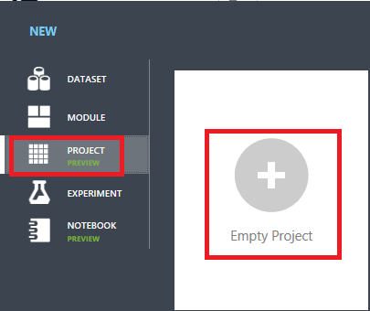
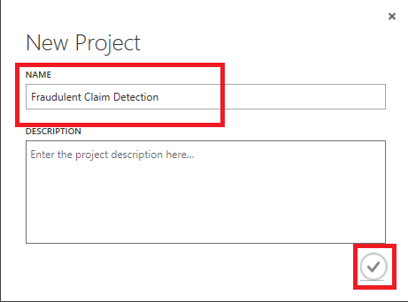
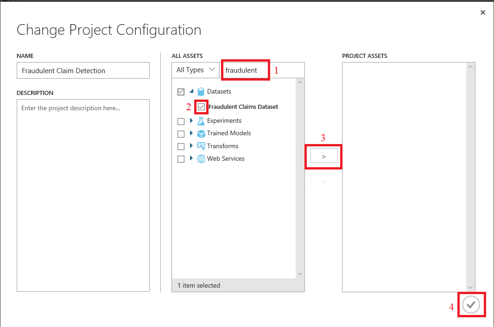
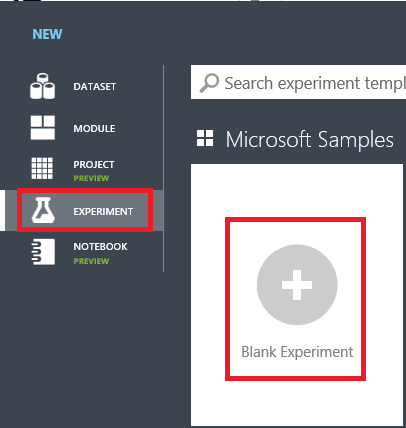
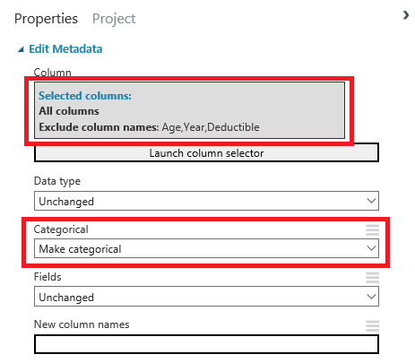

<a name="HOLTitle"></a>
# Fraudulent Claim Detection in Insurance Using Azure Machine Learning Studio #

[Microsoft Azure Machine Learning Studio](https://docs.microsoft.com/en-us/azure/machine-learning/studio/what-is-ml-studio "Microsoft Azure Machine Learning Studio") is a collaborative, drag-and-drop tool you can use to build, test, and deploy predictive analytics solutions on your data. Machine Learning Studio publishes models as web services that can easily be consumed by custom apps or BI tools such as Excel.

Machine Learning Studio is where data science, predictive analytics, cloud resources, and your data meet.

## The Machine Learning Studio interactive workspace ##

To develop a predictive analysis model, you typically use data from one or more sources, transform and analyze that data through various data manipulation and statistical functions, and generate a set of results. Developing a model like this is an iterative process. As you modify the various functions and their parameters, your results converge until you are satisfied that you have a trained, effective model.

**Azure Machine Learning Studio** gives you an interactive, visual workspace to easily build, test, and iterate on a predictive analysis model. You drag-and-drop **_datasets_** and analysis **_modules_** onto an interactive canvas, connecting them together to form an **_experiment_**, which you run in Machine Learning Studio. To iterate on your model design, you edit the experiment, save a copy if desired, and run it again. When you're ready, you can convert your **_training experiment_** to a **_predictive experiment_**, and then publish it as a **_web service_** so that your model can be accessed by others.

There is no programming required, just visually connecting datasets and modules to construct your predictive analysis model.


In this lab, you will create an Azure Machine Learning Studio experiment in which you will train a classification model to identify fraudulent claims in a dataset of an Insurance Company. Along the way, you will learn how to expose the trained model as a Web Service and consume it using REST APIs.

<a name="Objectives"></a>
### Objectives ###

In this hands-on lab, you will learn how to:

- Create an Azure Machine Learning Studio Project
- Add a dataset and train a Classification model in an experiment using labelled claims
- Test the trained Classification model 
- Create apps that leverage the Classification model by calling REST APIs 

<a name="Prerequisites"></a>
### Prerequisites ###

The following are required to complete this hands-on lab:

- A Microsoft Azure Machine Learning Studio account. If you don't have one, [sign up for free](https://studio.azureml.net/) - click on "Sign up here". Please choose the **_Standard Workspace_** option when prompted.
- Microsoft [Visual Studio Code](http://code.visualstudio.com) version 1.14.0 or higher
- [Node.js](https://nodejs.org) version 6.0 or higher

<a name="Resources"></a>
### Resources ###

All the resources you need are all located inside this repository where this README exists as well.

You should first either clone this repository, or download and unpack it onto your hard drive.

This repository itself contains the following sub-folders:

* `Experiment data` - a .csv file containing the training data we are going to use (labelled claims)
* `Using Azure Machine Learning Web Service to Predict Claim Fraud/Client/Fraud Detector/` - a desktop app written in Electron which you will use to test your Classification model (contains test data as well)
* `images` - different images used throughout this README

<a name="Cost"></a>
### Cost ###


There is no cost associated with this lab because it doesn't require an Azure subscription.

### Terminology ###

Azure Machine Learning Studio is going to be referenced hereinafter as AML Studio.

<a name="Exercises"></a>
## Exercises ##

This hands-on lab includes the following exercises:

- [Exercise 1: Create an AML Studio project](#Exercise1)
- [Exercise 2: Upload training dataset](#Exercise2)
- [Exercise 3: Train the Classification model in an AML Studio Experiment](#Exercise3)
- [Exercise 4: Evaluate the model and increase performance](#Exercise4)
- [Exercise 5: Create a Node.js app that uses the model](#Exercise5)
- [Exercise 6: Use the app to classify new claims](#Exercise6)

Estimated time to complete this lab: **45** minutes.

<a name="Exercise1"></a>
## Exercise 1: Create an AML Studio project ##

The first step in building a classification model within AML Studio is to create a project. In this exercise, you will use the AML Studio portal to create a 

1. Open the [AML Studio portal](https://studio.azureml.net/) in your browser. Then click **Sign In**. 
 
    

    _Signing in to the AML Studio portal_

1. If you are asked to sign in, do so using the credentials for your Microsoft account. If you are asked to let this app access your info, click **Yes**, and if prompted, agree to the terms of service.

1. Click **New** >> **Project** > **Empty Project** to create a new empty project.
  
	

    _Creating a new resource_
	
	

    _Choosing to create an empty project_

1. In the "New project" dialog, name the project **Fraudulent Claim Detection** and click **Ok**.

	

    _Creating an AML Studio project_

The next step is to upload the claims dataset to be used for training to the project.

<a name="Exercise2"></a>
## Exercise 2: Upload training dataset ##

In this exercise, you will upload the claims dataset of the Insurance Company. This dataset will be used during the training and testing activities of your model.
  
1. Click **Datasets** to add or inspect the datasets at hand.

	

    _Accessing Datasets_ 
 
1. Click **New** >> **Dataset** >> **From Local File**.

	

    _Creating a new resource_ 
    
    
	
    _Add Dataset from Local File_
 
1. Browse to the `Experiment data` folder, select the claims.csv file, and click **Open**.
 
1. Type `Fraudulent Claims Dataset` into the **Enter a name for the new dataset** box. Select `Generic CSV File with a header (.csv)` in the **Select a type for the new dataset** box and then click **Ok**.

	

    _Configuring the new dataset_ 

1. To add this dataset to the project, go to **Projects** and the click on the previously created project called **_Fraudulent Claim Detection_**.

	

    _Accessing the project_ 

1. Search for the **_Fraudulent Claims Dataset_** dataset in the **Search Assets** box, click the checkbox of it once found and transfer it to the **Project Assets** by clicking the **arrow pointing to the right**.

	

    _Adding the dataset as project asset_ 

With the dataset uploaded and attached to the project, you are ready to create your experiment and train your own Classification model. Onto the next exercise!

<a name="Exercise3"></a>
## Exercise 3: Train the Classification model in an AML Studio Experiment ##

In this exercise, you will create an experiment in which you will train a Classification model (Boosted Decision Tree) using the **Fraudulent Claims Dataset** you have uploaded in the portal.
 
1. Click **New** >> **Experiment** >> **Blank Experiment**.

	

    _Creating a new blank experiment_ 

2. Name the experiment to **Fraudulent Claim Detection Experiment** on the experiment canvas.

	

    _Renaming the experiment_ 
	
3. Drag and drop the **Fraudulent Claims Dataset** dataset on the experiment canvas by searching for its name in the module search bar on the left hand site or manually finding it under **Saved Datasets** >> **My Datasets**.

	

    _Searching the dataset and adding it to the canvas_
	
4. Drag and drop the **Edit Metadata** module on the experiment canvas by searching for its name in the module search bar on the left hand site or manually finding it under **Data Transformation** >> **Manipulation**.
	
5. Click the _output port_ of the **Fraudulent Claims Dataset** module and connect it to the _input port_ of the **Edit Metadata** module by _dragging and dropping_.

	

    _Add the Edit Metadata module and connect modules_
	
6. Inspect the properties of newly added **Edit Metadata** module by clicking it and going through the right-hand site.

	

    _Inspecting Edit Metadata Properties_
	
* `Selected columns`: interactive column selector which gets its data source from the previous connected module;
* `Data type`: columns which have been chosen in this module will been converted to the **option** selected from this list (**Unchanged** means no data type conversion occurs);
* `Categorical`: columns which have been chosen in this module will be converted to categorical features, meaning all operations which happen on categorical features will work and columns will be interpreted as such by the models (e.g. **One Hot Encoding**);
* `Fields`: use this option if you want to change the way that Azure Machine Learning uses the data in a model
	* **Feature**: Use this option to flag a column as a feature, for use with modules that operate only on feature columns. By default, all columns are initially treated as features.

	* **Label**: Use this option to mark the label (also known as the predictable attribute, or target variable). Many modules requires that at least one (and only one) label column be present in the dataset.
	
		In many cases, Azure Machine Learning can infer that a column contains a class label, but by setting this metadata you can ensure that the column is identified correctly. Setting this option does not change data values, only the way that some machine learning algorithms handle the data.

	* **Weight**: Use this option with numeric data to indicate that column values represents weights for use in machine learning scoring or training operations. Only one weight column can be present in a dataset, and the column must be numeric.
	
	* **Clear feature**: Use this option to remove the feature flag
	
	* **Clear label**: Use this option to remove the **label** metadata from the specified column
	
	* **Clear score**: Use this option to remove the **score** metadata from the specified column
	
	* **Clear weight**: Use this option to remove the **weight** metadata from the specified column
	
* `New column names`: type the new name of the selected column or columns

7. Configure the **Edit Metadata** module so that the `FraudFound_P` column of the dataset is treated as a **label**.

	

    _Add the **label** metadata to the FraudFound_P column_

<a name="Exercise4"></a>
## Exercise 4: Test the model ##

8. Add a new **Edit Metadata** module which will **_Make categorical_** all columns in the dataset, excluding `Age`, `Deductible`, `Year`. Connect this to the output module of the previous 

	

    _Choose columns which will be transformed to categorical_
	
	

    _Configure the categorical setting_

In [Exercise 5](#Exercise5), you will create a Node.js app that uses the model to identify the correct BMW model in images presented to it. But you don't have to write an app to test the model; you can do your testing in the portal, and you can further refine the model using the images that you test with. In this exercise, you will test the model's ability to identify the BMW model using test images provided for you.

1. Click **Quick Test** at the top of the page.
 
	

    _Testing the model_ 

1. Click **Browse local files**, and then browse to the `resources\images\bmw_cars\test` folder in the lab resources. Select any image, and click **Open**.

	

    _Selecting a test image_ 

1. Examine the results of the test in the "Quick Test" dialog. What is the probability that the car is an E60 or another model?

1. Try a couple more test images and examine the results. How is the model performing? Any ideas on how we might improve such a model?

Now let's go a step further and incorporate the model's intelligence into an app.

<a name="Exercise5"></a>
## Exercise 5: Create a Node.js app that uses the model ##

The true power of the Microsoft Custom Vision Service is the ease with which developers can incorporate its intelligence into their own applications using the [Custom Vision Prediction API](https://southcentralus.dev.cognitive.microsoft.com/docs/services/eb68250e4e954d9bae0c2650db79c653/operations/58acd3c1ef062f0344a42814). In this exercise, you will use Visual Studio Code to modify an app to use the model you built and trained in previous exercises.

1. If Node.js isn't installed on your system, go to https://nodejs.org and install the latest LTS version for your operating system.

	> If you aren't sure whether Node.js is installed, open a Command Prompt or terminal window and type **node -v**. If you don't see a Node.js version number, then Node.js isn't installed. If a version of Node.js older than 6.0 is installed, it is highly recommend that you download and install the latest version.

1. If Visual Studio Code isn't installed on your workstation, go to http://code.visualstudio.com and install it now.

1. Start Visual Studio Code and select **Open Folder...** from the **File** menu. In the ensuing dialog, select the `resources\clientapp` folder included in the lab resources.

	

    _Selecting the client app folder_ 

1. Use the **View** > **Terminal** command to open a terminal window in Visual Studio Code. Then execute the following command in the integrated terminal to load the packages required by the app:

	```
	npm install
	```

1. Return to the BMW Cars project in the Custom Vision Service portal, click **Performance**, and then click **Make default** to make sure the latest iteration of the model is the default iteration. 

	

    _Specifying the default iteration_ 

1. Before you can run the app and use it to call the Custom Vision Service, it must be modified to include endpoint and authorization information. To that end, click **Prediction URL**.

	

    _Viewing Prediction URL information_ 

1. The ensuing dialog lists two URLs: one for uploading images via URL, and another for uploading local images. Copy the Prediction API URL for image files to the clipboard. 

	

    _Copying the Prediction API URL_ 

1. Return to Visual Studio Code and click **predict.js** to open it in the code editor.

	

    _Opening predict.js_ 

1. Replace `<Custom Vision Prediction URI>` with the URL on the clipboard.

    ```js
    // Replace <Custom Vision Prediction URI> with your valid Prediction URI for Custom Vision.
    const predictionUri = '<Custom Vision Prediction URI>';
    ```

1. Return to the Custom Vision Service portal and copy the Prediction API key to the clipboard. 

	

    _Copying the Prediction API key_ 

1. Return to Visual Studio Code and replace `<Prediction Key>` with the API key on the clipboard.

    ```js
    // Replace <Prediction Key> with your valid prediction key.
    const predictionKey = '<Prediction Key>';
    ```

1. Scroll down in **predict.js** and examine the block of code that begins on line 34. This is the code that calls out to the Custom Vision Service using AJAX. Using the Custom Vision Prediction API is as easy as making a simple, authenticated POST to a REST endpoint.

    ```js
        $.ajax({
            type: "POST",
            url: predictionUri,
            data: imageBytes,
            processData: false,
            headers: {
                "Prediction-Key": predictionKey,
                "Content-Type": "multipart/form-data"
            }
        }).done(function (data) {

            var predictions = data.predictions;
            ...
    ```

    _Making a call to the Prediction API_ 

1. Return to the integrated terminal in Visual Studio Code and execute the following command to start the app:

	```
	npm start
	```


The client app is a cross-platform app written with Node.js and [Electron](https://electron.atom.io/). As such, it is equally capable of running on Windows, macOS, and Linux. In the next exercise, you will use it to classify images of BMW cars and display them.

<a name="Exercise6"></a>
## Exercise 6: Use the app to classify images ##

In this exercise, you will use the app to submit images to the Custom Vision Service for classification. The app uses the JSON information returned from calls to the Custom Vision Prediction API's [PredictImage](https://southcentralus.dev.cognitive.microsoft.com/docs/services/eb68250e4e954d9bae0c2650db79c653/operations/58acd3c1ef062f0344a42814) method to tell you what type of BMW model the picture contains. It also shows the probability that the classification assigned to the image is correct.

1. Click the **Browse (...)** button in the  app. 

1. Browse to the `tests` folder in the lab resources. Select any image file and then click **Open**.

1. Click the **Predict** button to submit the image to the Custom Vision Service.

	

    _Submitting the image to the Custom Vision Service_ 

1. Check that the app identifies the image as a specific BMW model. Is that the correct model of the car?
 
1. Repeat steps 1 through 4 for a random image (not containing any car) and confirm that the app does **not** classify the image as any known BMW model.

	

    _Submitting a non-car image to the Custom Vision Service_ 

1. As you can see, using the Prediction API from an app is just as reliable as through the Custom Vision Service portal — and way more fun! What's more, if you go to the Predictions page in the portal, you'll find that each of the images uploaded via the app is shown there as well.
 
Feel free to test with more images of your own and gauge the model's adeptness at identifying the right BMW model. And remember that in general, the more images you train with, the smarter the model will be.

<a name="Summary"></a>
## Summary ##

Image classification is playing an increasingly large role in industry as a means for automating such tasks as checking images uploaded to Web sites for offensive content and inspecting parts rolling off of assembly lines for defects. Building an image-classification model manually — that is, coding it from the ground up in Python, R, or another language — requires no small amount of expertise, but the Custom Vision Service enables virtually anyone to build sophisticated image-classification models. And once a model is built and trained, an app that uses it is only few lines of code away.

---

Copyright 2018 Microsoft Corporation. All rights reserved. Except where otherwise noted, these materials are licensed under the terms of the MIT License. You may use them according to the license as is most appropriate for your project. The terms of this license can be found at https://opensource.org/licenses/MIT.
